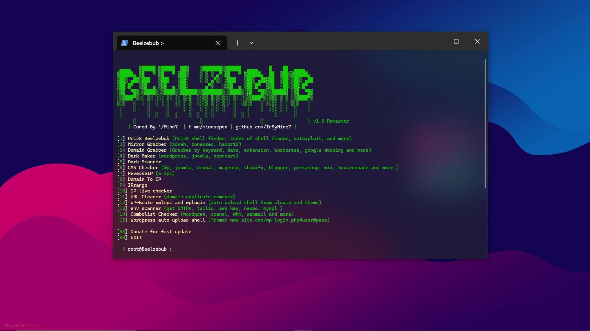

# Beelzebub v1.6 Remaster

<p align="center">
  
</p>

A comprehensive web security and penetration testing toolkit.

## Features

1. **Priv8 Beelzebub**
   - Priv8 Shell finder
   - Index of shell finder
   - AutoXploit capabilities

2. **Mirror Grabber**
   - Zone-H
   - ZoneXsec
   - HaxorID

3. **Domain Tools**
   - Multiple domain grabbers (Azstats, Bestwebsiterank, Topmillion, etc.)
   - Domain grabbing by date
   - Domain grabbing by keyword
   - Google dorking capabilities
   - WordPress specific domain grabber
   - Theme grabber

4. **Dork Tools**
   - Dork maker for WordPress, Joomla, OpenCart
   - Dork scanner

5. **CMS Tools**
   - CMS detection and checking
   - Support for:
     - WordPress
     - Joomla
     - Drupal
     - Magento
     - Shopify
     - Blogger
     - PrestaShop
     - Wix
     - Squarespace

6. **IP Tools**
   - ReverseIP with 6 APIs
   - Domain to IP conversion
   - IP range scanner
   - IP live checker

7. **WordPress Tools**
   - WP-Brute xmlrpc and wp-login
   - WordPress auto upload shell

8. **Security Testing**
   - Environment scanner (SMTP, Twilio, AWS key, Nexmo, MySQL)
   - Combolist checker (WordPress, cPanel, WHM, webmail)
   - URL cleaner (domain duplicate remover)

## Installation

1. Clone the repository:
```bash
git clone https://github.com/InMyMine7/Beelzebub.git
cd Beelzebub
```

2. Install required dependencies:
```bash
pip install -r requirements.txt
```

## Usage

Run the main script:
```bash
python main.py
```

Select from the available options in the menu to use different features.

## Requirements

- Python 3.x
- See requirements.txt for complete list of dependencies

## Support

For updates and support:
- Telegram: t.me/minesepen
- GitHub: github.com/InMyMine7

## Disclaimer

This tool is for educational purposes only. Users are responsible for their own actions. The developers assume no liability and are not responsible for any misuse or damage caused by this program.

## Contributing

If you want to contribute to this project, please make sure to follow the existing code style and submit your pull requests.

## License

This project is licensed under the MIT License - see the LICENSE file for details.

## Donate

If you find this tool useful, consider supporting the development:
- Saweria: saweria.co/InMyMine7
- Buy Me a Coffee: buymeacoffee.com/inmymine72
- BTC: bc1qlx7n3x3wvacd6dnpv48ksk9zfvu7pvk904xr3s
